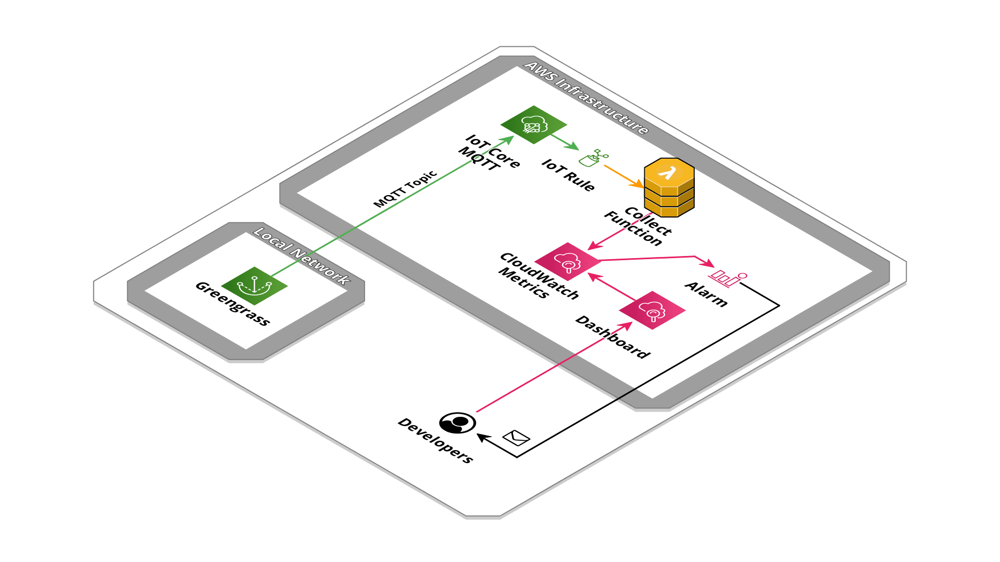

# Greengrass Nucleus telemetry data collector


Collect Nucleus telemetry data as CloudWatch metrics.

## Created resources

This integration will deploy a Lambda function connect to IoT Core MQTT topic where NucleusEmitter component send telemetry data and collect them as CloudWatch metrics.



## Requirements

This integration requires component [aws.greengrass.telemetry.NucleusEmitter](https://docs.aws.amazon.com/greengrass/v2/developerguide/nucleus-emitter-component.html?icmpid=docs_gg_console) installed and configured on the Greengrass Core device.

Set the `mqttTopic` property with the AWS IoT Core MQTT topic to which telemetry data will be sent: 
```json
{
  "mqttTopic": "greengrass/MyDeviceName",
  "telemetryPublishIntervalMs": 300000
}
```
in this example, the telemetry publish interval was set to 5 minutes, as an EC2-like metrics.

## Installation

Using the [SAM CLI](https://docs.aws.amazon.com/serverless-application-model/latest/developerguide/what-is-sam.html):
```bash
sam deploy --guided
```

## Parameters

- **MqttTopic**: MQTT Topic name (for example `greengrass/MyDeviceName`).

- **CoreDevice**: Greengrass Core Device name, used as `CoreDevice` metric dimension (for example `MyDeviceName`).

- **MetricNamespace**: CloudWatch metric namespace name (default `Greengrass`).

## Published CloudWatch Metrics

- **Greengrass/SystemMemUsage** (Megabyte): The amount of memory currently in use by all applications on the Greengrass core device, including the operating system. 

- **Greengrass/CpuUsage** (Percent): The amount of CPU currently in use by all applications on the Greengrass core device, including the operating system. 

- **Greengrass/TotalNumberOfFDs** (Count): The number of file descriptors stored by the operating system of the Greengrass core device. One file descriptor uniquely identifies one open 
file. 
- **Greengrass/NumberOfComponentsRunning** (Count): The number of components that are running on the Greengrass core device.

- **Greengrass/NumberOfComponentsErrored** (Count): The number of components that are in error state on the Greengrass core device.

- **Greengrass/NumberOfComponentsInstalled** (Count): The number of components that are installed on the Greengrass core device.

- **Greengrass/NumberOfComponentsStarting** (Count): The number of components that are starting on the Greengrass core device.

- **Greengrass/NumberOfComponentsNew** (Count): The number of components that are new on the Greengrass core device.

- **Greengrass/NumberOfComponentsStopping** (Count): The number of components that are stopping on the Greengrass core device.

- **Greengrass/NumberOfComponentsFinished** (Count): The number of components that are finished on the Greengrass core device.

- **Greengrass/NumberOfComponentsBroken** (Count): The number of components that are broken on the Greengrass core device.

- **Greengrass/NumberOfComponentsStateless** (Count): The number of components that are stateless on the Greengrass core device.

## Credits

- Repository badges by [Shields.io](https://shields.io/)
- Infrastructure schema by [Cloudcraft](https://www.cloudcraft.co/)
